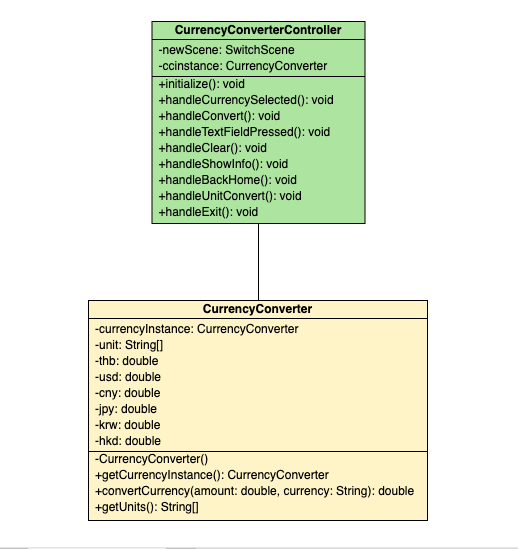
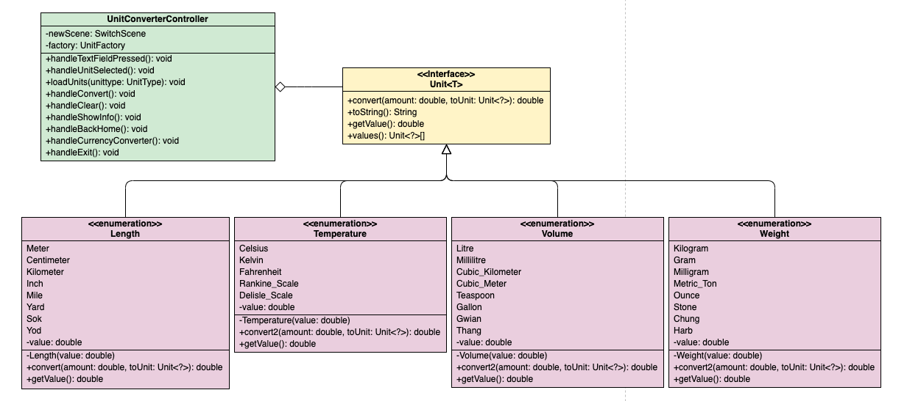
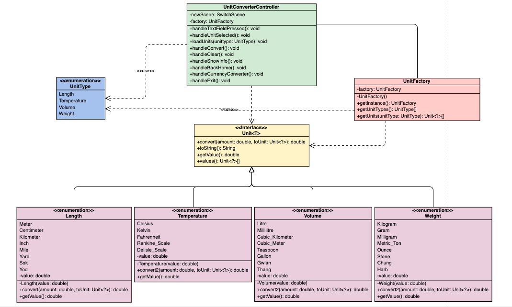
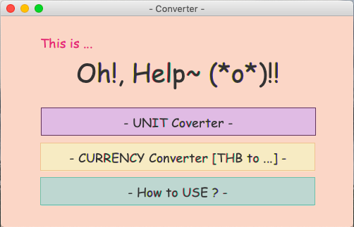
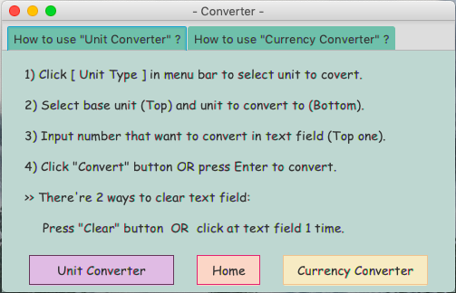
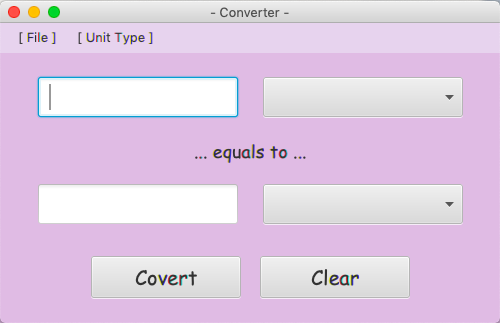
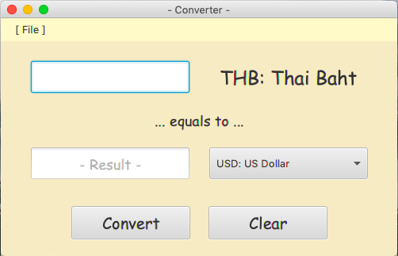

# Final_LabSSD_Project

**Table of Contents**
- [About this Application](#about-this-application)
- [Design Patterns](#design-patterns)
- [How to use?](#how-to-use?)
- [Contributor](#contributor)

## About this Application

&nbsp;&nbsp;&nbsp;&nbsp;&nbsp;&nbsp;&nbsp;&nbsp;&nbsp;**Unit Converter** application with User Interface (UI) use to convert one unit to another that have the same type of unit.

**Unit Types in the application:**
- *Currency*: Thai Baht (THB), US Dollar (USD), Chinese Yuan (CNY), Japanese Yen (JPY), Korean Won (KRW) and Hong Kong Dollar (HKD)
- *Length*: Meter, Centimeter, Kilometer, Inch, Mile, Yard, Sok and Yod
- *Temperature*: Celsius, Kelvin, Fahrenheit, Rankine_Scale and Delisle_Scale
- *Volume*: Litre, Millilitre, Cubic_Kilometer, Cubic_Meter, Teaspoon, Gallon, Gwian and Thang
- *Weight*: Kilogram, Gram, Milligram, Metric_Ton, Ounce, Stone, Chung and Harb

## Design Patterns
#### Singleton Design Pattern
- This design pattern use in CurrencyConverter class, so that when I use this class in CurrencyConverterController class, I only call getCurrencyInstance() to use it.

#### Strategy Design Pattern
- This design pattern use for the convert() method which will calculate and return the converted value in different strategy depends on the unit type.

#### Factory Design Pattern
- This design pattern use in UnitFactory class, this really useful when user change the unit type that user want to convert (for example, change from Length to Volume), UnitConverterController class no need to worry about create the object of that unit because UnitFactory class will choose and create those unit for UnitConverterController class to use. 

## How to use?

Since my app doesn't have .jar file to run, then you can download/clone this project and run `Main.java` file.

After you run the `Main.java` file, ...

1) Click to converter that you want or you can read the app instructions instead.

    

2) If you click `How to use?`

    

3) If you click converter, ...
    1. Unit Converter
        1. Click `Unit Type` in menu bar to select unit to covert.
        2. Select base unit (Top) and unit to convert to (Bottom).
        3. Input number that want to convert in text field (Top one).
        4. Click "Convert" button OR press Enter to convert.
        5. Get your result :)
        
        
        
    2. Currency Converter
        1. Select currency unit that want to convert to.
        2. Input amount of Thai Baht (THB) that want to convert in text field.
        3. Click "Convert" button OR press Enter to convert.
        4. Get your result :)
        
        
    - There're 2 ways to clear text field in both converters:
        1. Press "Clear" button.
        2. Click at text field 1 time.
    
## Contributor
Created by **6010545692 Kunyaruk Katebulu**